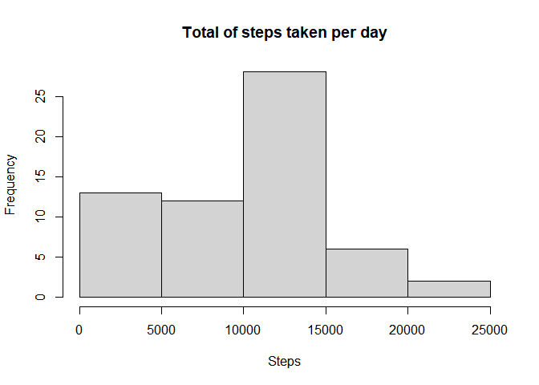
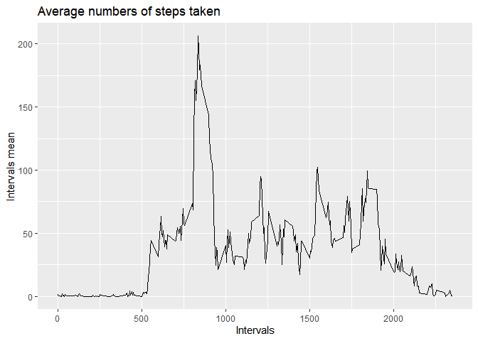
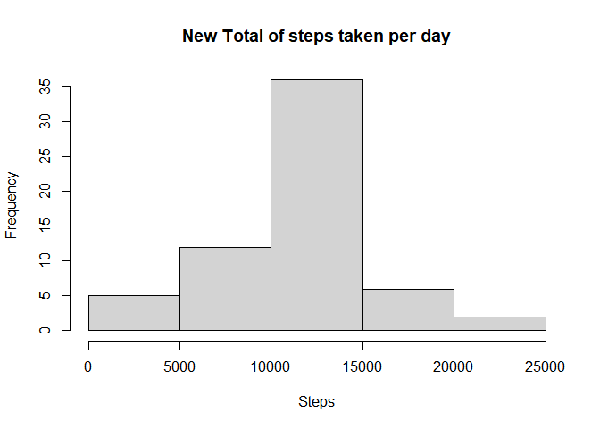
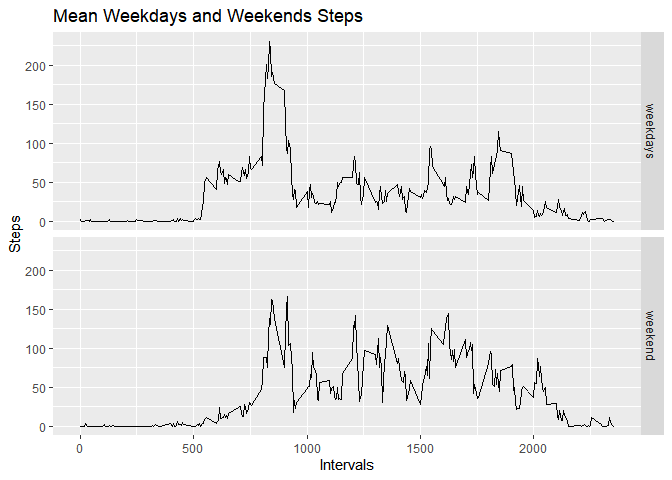

Before starting please be sure to have installed the following packages:   
1. dplyr   
2. ggplot2   


```r
library(ggplot2)
library(dplyr)
```
<hr>

## Loading and preprocessing the data

As expected, we'll load the data and change some columns to their appropriate column type.


```r
#Unzip
if(file.exists("activity.csv")){
        print("File already unzipped.")
} else {
        unzip("activity.zip")
}
```

```
## [1] "File already unzipped."
```

```r
#Load the data
activity_dt<- read.csv("activity.csv")

#Change column 'date' to Date type
activity_dt$date<- as.Date(activity_dt$date)
```

<hr>


## What is mean total number of steps taken per day?

We'll check the histogram to see the frequency.


```r
#Exclude NA's
activity_dt_no_na<- activity_dt[complete.cases(activity_dt),]

#Steps per day
total_steps_per_day <- with(activity_dt, tapply(steps, as.factor(activity_dt$date), 
                                             sum, na.rm = TRUE))

#Plot the histogram

hist(total_steps_per_day, main="Total of steps taken per day", xlab="Steps")
```

<!-- -->

Median and mean


```r
#Summary
summary(total_steps_per_day)
```

```
##    Min. 1st Qu.  Median    Mean 3rd Qu.    Max. 
##       0    6778   10395    9354   12811   21194
```

<hr> 


## What is the average daily activity pattern?

We'll group the original data set, that's to say, including NA's, and group them
by the *interval* column, so we can calculate the aggregate mean.

```r
total_steps_per_interval <- activity_dt_no_na%>%
  select(steps, date, interval)%>%group_by(interval)%>%
  summarise(mean=mean(steps))
```

Plot and annotations


```r
p<- ggplot(total_steps_per_interval)
p <- p + aes(x=interval, y=mean)+ geom_line()+ labs(
  title="Average numbers of steps taken", x="Intervals",
                                                    y="Intervals mean")
print(p)
```

<!-- -->

Finally, we'll see which interval has the most steps:


```r
total_steps_per_interval[which.max(total_steps_per_interval$mean),]
```

```
## # A tibble: 1 x 2
##   interval  mean
##      <int> <dbl>
## 1      835  206.
```

<hr>

## Imputing missing values

Total number of missing values


```r
na_number <- sum(is.na(activity_dt$steps))
na_number
```

```
## [1] 2304
```


Let's continue by filling those missing values


```r
#Extract only the NAs
missing_obs <- activity_dt[is.na(activity_dt$steps),]

#Group the data by its intervals
mean_per_int <- activity_dt%>%
  select(steps, date, interval)%>%group_by(interval)%>%
  summarise(mean=mean(steps, na.rm=T))

#Fill the NA in the steps column with the average of the corresponding interval
for (i in missing_obs$interval){
  missing_obs[missing_obs$interval==i,]$steps<-mean_per_int$mean[mean_per_int$interval==i]
}
```

Create a new data set


```r
new_dataset <- rbind(activity_dt[!is.na(activity_dt$steps),], missing_obs)
```

Plot the new data set


```r
new_total_steps_per_day <- with(new_dataset, tapply(steps, as.factor(new_dataset$date), 
                                             sum, na.rm = TRUE))
#Plot the histogram

hist(new_total_steps_per_day, main="New Total of steps taken per day", xlab="Steps")
```

<!-- -->

Filling NAs


```r
summary(new_total_steps_per_day)
```

```
##    Min. 1st Qu.  Median    Mean 3rd Qu.    Max. 
##      41    9819   10766   10766   12811   21194
```

Without filling NAs


```r
summary(total_steps_per_day)
```

```
##    Min. 1st Qu.  Median    Mean 3rd Qu.    Max. 
##       0    6778   10395    9354   12811   21194
```

Yes, they're slightly different.

<hr>


## Are there differences in activity patterns between weekdays and weekends?

Create a new factor variable


```r
new_dataset$days <- weekdays(new_dataset$date)
new_dataset[!(new_dataset$days=="sábado"|new_dataset$days=="domingo"),]$days<-
  "weekdays"
new_dataset[new_dataset$days=="sábado"|new_dataset$days=="domingo",]$days<-
  "weekend"
avg_steps_week<- aggregate(steps ~ interval+days, data= new_dataset, mean)
```

Plot the mean of weekdays and weekends


```r
p2 <- ggplot(avg_steps_week)
p2 <- p2 + aes(x=interval, y=steps)+ geom_line()+
  labs(title="Mean Weekdays and Weekends Steps",y="Steps",x="Intervals")+
  facet_grid(rows=2, facets = "days")
       
 
print(p2)
```

<!-- -->


<hr>
